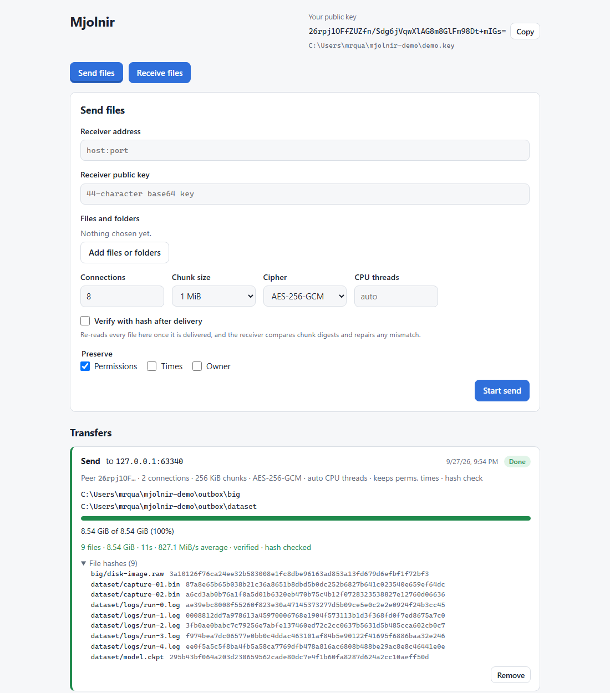
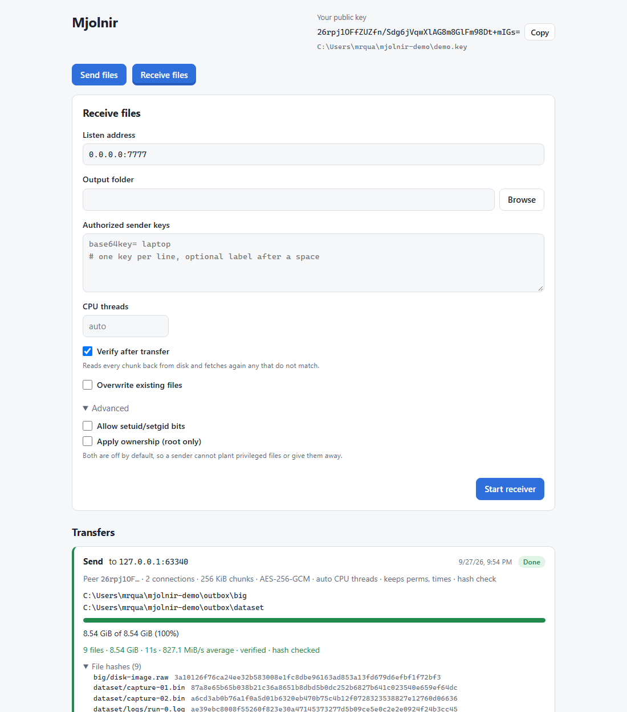

# Web UI

`mjolnir serve` runs a small local web app for starting and watching
transfers. It uses the same key as the command line and runs the same library
code, so a transfer started in the browser is identical to one started with
`mjolnir send` or `mjolnir recv`.

```
mjolnir serve [--listen 127.0.0.1:7878] [--key PATH] [--no-open]
```

It prints a URL like

```
Mjolnir web UI: http://127.0.0.1:7878/#token=3f9c0d6e1a2b4c5d6e7f8091a2b3c4d5
```

and opens it in the default browser unless `--no-open` is given. Without
`--key` it loads the default key file, creating one on first run. The server
runs until you stop it with Ctrl-C; stopping it aborts every transfer it
started.


## Using it

The header shows your public key with a Copy button. Give it to the other
side: a receiver lists it as an authorized sender, and a sender pins it as
the receiver's key.

**Receive files.** Pick a listen address (default `0.0.0.0:7777`, use port 0
for any free port), an output folder, and the sender keys to admit, one per
line as `key [label]`. Tick "Overwrite existing files" to replace files that
already exist in the output folder. "Verify after transfer" (on by default)
reads every chunk back from disk before finishing and fetches again any that
do not match. "CPU threads" sets how many workers open chunks; leave it
empty for one per core. Under "Advanced", "Allow setuid/setgid bits" and
"Apply ownership (root only)" let the sender's file map set those; both are
off, so by default a sender cannot plant privileged files or choose their
owner. The receiver binds immediately, so a port that is already in use is
reported on the form. Its card shows the bound
address with a Copy button, to paste into the sender's form. Each receiver
takes one complete transfer, then finishes; a sender that fails the
handshake or drops mid-session does not end it, and it goes back to waiting.
Several receivers can wait on different ports at once, each with its own
output folder; a folder that is, contains, or is inside a running
receiver's folder is refused.

**Send files.** Enter the receiver's address and public key, add files and
folders with the file browser, and optionally tune the number of connections
(1 to 64, default 8), the chunk size, the cipher, and the CPU threads that
seal chunks (empty means one per core). "Verify with hash after delivery"
re-reads every file on this side once it is delivered; the receiver compares
the chunk digests and fetches any mismatch again. "Preserve" chooses what
the file map carries: permissions (on by default), modification times, and
owner. Recent peers are remembered in the browser.






Each transfer card shows its phase, a progress bar, bytes done and total,
throughput and ETA (computed in the browser from successive polls), and the
number of active connections. Running transfers have a Cancel button;
finished ones have Remove. Failed transfers show the error. Finished ones show
a summary: files, bytes, time, average speed, whether every chunk was
verified and hash checked, and any repaired, hash-repaired, duplicate, or
resent chunks. Warnings (metadata the receiver could not apply) and skipped
files (symbolic links and special files the sender left out) are listed when
there are any, and the per-file hashes sit in a collapsible section. A line
below the summary gives the time per stage (connect, transfer with its
MiB/s, verify, hash, finalize), leaving out stages that took no time.


The page follows the system light or dark theme and works down to phone
width.


## Security model

The server can read any file the user can read and send it to any address,
so every request is treated as hostile until it proves otherwise.

- **Loopback by default.** It binds `127.0.0.1` unless `--listen` says
  otherwise. Any other address prints a loud warning, because anyone who can
  reach the port and learns the token has full control.
- **Per-run access token.** Each run generates a random 128-bit token. It
  travels in the URL fragment (`#token=...`), which browsers never send to
  the server, so it stays out of request lines, logs, and `Referer` headers.
  The page moves it into `sessionStorage`, removes it from the address bar,
  and sends `Authorization: Bearer <token>` on every API call. The server
  compares it in constant time. A missing or wrong token gets 401. The static
  page itself (`/`, `/app.js`, `/app.css`) needs no token and holds no data.
- **DNS-rebinding guard.** A request whose `Host` header is not
  `127.0.0.1:PORT`, `localhost:PORT`, or `[::1]:PORT` gets 403. When bound
  to a specific non-loopback address, that address is also accepted. When
  bound to `0.0.0.0` or `::`, any IP literal with the right port is accepted;
  a rebinding attack needs a DNS name in `Host`, so IP literals are safe.
- **No cross-origin writes.** Every non-GET request must carry
  `Content-Type: application/json`, which a cross-origin page cannot send
  without a CORS preflight, and the server never answers preflights or sends
  CORS headers. If an `Origin` header is present it must be
  `http://<Host>`. Violations get 403.
- **Browser hardening.** The HTML is served with
  `Content-Security-Policy: default-src 'self'; connect-src 'self'; script-src 'self'; ...`,
  `frame-ancestors 'none'`, `X-Frame-Options: DENY`,
  `X-Content-Type-Options: nosniff`, `Referrer-Policy: no-referrer`, and
  `Cache-Control: no-store`. Scripts and styles are separate embedded files,
  so no inline script is needed. The page builds the DOM with `textContent`,
  never `innerHTML`, so file names and error text cannot inject markup.
- **Bounded input, enforced at the transport.** The server is a small
  strict HTTP/1.1 reader on `std`, not a general web framework, so every
  limit is applied before any allocation the client controls. The request
  head (request line plus headers) is capped at 16 KiB (431 beyond that)
  and must arrive within 10 s. A body is read only after the request has
  passed the Host, token, Content-Type, and Origin checks, only up to
  1 MiB (413 beyond that, without reading it), and within 30 s. A rejected
  request is answered and its connection closed; the body its
  `Content-Length` announced is never read or reserved. `Transfer-Encoding`
  and requests with two disagreeing `Content-Length` values are refused
  (400). Each connection carries one request, gets its own thread, and at
  most 64 connections are served at once; further ones are closed at
  accept. Every field is parsed and range-checked in the handler before any
  work starts.
- **No endpoint returns the private key.** The API gives only the public
  key and the key file's path. The key file is still a file this user can
  read, though, so whoever holds the token can pick it, like any other
  readable file, in a send to a receiver of their choosing. The token is
  what guards it.

## API

All endpoints live under `/api`, require the token, and speak JSON. Errors
have the shape `{ "error": "message", "field": "name" | null }`, where
`field` names the request field at fault.

| Status | Meaning |
|--------|---------|
| 400 | Invalid input; `field` says which |
| 401 | Missing or wrong token |
| 403 | Bad `Host`, bad `Origin`, or a non-JSON write |
| 404 | No such transfer or endpoint |
| 405 | Wrong method for the endpoint |
| 409 | Removing a transfer that is still running, or a receiver whose `out_dir` overlaps a running receiver's |
| 413 | Body over 1 MiB |
| 431 | Request head over 16 KiB |

### `GET /api/identity`

```json
{ "public_key": "base64", "key_path": "/home/me/.config/mjolnir/key" }
```

### `GET /api/transfers`

`{ "transfers": [Transfer, ...] }`, newest first. The 100 most recently
ended transfers are kept; older ones drop off the list. In the list, a
`report` is a summary: the totals below, with `file_hash_count`,
`warning_count`, and `skipped_count` in place of the three lists, so a poll
stays small however many files the finished transfers held.

### `GET /api/transfers/{id}`

One Transfer with its whole `report`, lists included. The UI fetches it
once when a transfer ends.

```json
{
  "id": 2,
  "kind": "send",
  "spec": {
    "addr": "10.0.0.2:7777",
    "peer": "base64",
    "paths": ["/data/run-42"],
    "connections": 8,
    "chunk_size": 1048576,
    "cipher": "Aes256Gcm",
    "threads": 0,
    "hash": true,
    "preserve": { "perms": true, "times": false, "owner": false }
  },
  "created_at_ms": 1790000000000,
  "state": "running",
  "error": null,
  "report": null,
  "bound_addr": null,
  "progress": {
    "phase": "transferring",
    "bytes_done": 734003200,
    "bytes_total": 2147483648,
    "chunks_done": 700,
    "chunks_total": 2048,
    "active_connections": 8
  },
  "elapsed_ms": 1840
}
```

- `kind` is `send` or `receive`. A receive `spec` is
  `{ "listen", "authorized": [keys], "out_dir", "force", "verify", "threads", "apply": { "allow_special_bits", "allow_owner" } }`.
- `state` is `running`, `done`, `failed`, or `cancelled`. `error` is set
  when failed, `report` when done:

  ```json
  {
    "files": 9, "bytes": 9170000000, "elapsed_ms": 10400,
    "verified": true, "hashed": true,
    "chunks_resent": 0, "repaired_chunks": 0, "hash_repaired_chunks": 0, "stale_chunks": 0, "duplicate_chunks": 0,
    "file_hashes": [{ "path": "dataset/model.ckpt", "hash": "295b43bf..." }],
    "warnings": [], "skipped": [],
    "phase_times": { "connect_ms": 21.4, "transfer_ms": 9800.0, "verify_ms": 1100.0, "hash_ms": 1400.0, "finalize_ms": 30.2 }
  }
  ```

  Counts that do not apply to a side are 0. The receiver always lists file
  hashes; the sender lists them only when `hash` was on. `skipped` is filled
  on the sender, `warnings` mostly on the receiver. `phase_times` is the
  time spent per stage in milliseconds. The sender follows the receiver: its
  `transfer_ms` lasts until the receiver has absorbed each round, its
  `verify_ms` is the receiver's read-back, and its `finalize_ms` covers only
  the digests, file map, and `Finished`. On a receiver `connect_ms` covers
  only the last session's handshake.
- `bound_addr` is the receiver's actual listening address, `null` for sends.
- `progress.phase` is `connecting`, `handshaking`, `transferring`,
  `verifying`, `hashing`, `finishing`, `done`, or `failed`. `bytes_total` is 0
  until the manifest is known. While verifying or hashing, `bytes_done` counts
  bytes read back.
- `elapsed_ms` counts from creation to now, or to the end once finished.

### `POST /api/send`

```json
{
  "addr": "host:port",
  "peer": "base64 receiver key",
  "paths": ["/data/run-42", "/data/notes.txt"],
  "connections": 8,
  "chunk_size": 1048576,
  "cipher": "Aes256Gcm",
  "threads": 0,
  "hash": false,
  "preserve": { "perms": true, "times": false, "owner": false }
}
```

`connections` (1 to 64), `chunk_size` (4 KiB to 64 MiB), `cipher`
(`Aes256Gcm` or `ChaCha20Poly1305`), `threads` (0 to 256, 0 meaning one
per core), `hash`, and `preserve` are optional with the defaults shown.
`preserve` must name all three flags when given.
`addr` may be a host name; it is resolved when the transfer starts. Every
path must exist. Returns the new Transfer.

At most 16 transfers, sends and receives together, run at once; one more
is refused with 429 until one ends. A transfer whose thread cannot start,
or whose code panics, ends as `failed` rather than staying `running`.

### `POST /api/receive`

```json
{
  "listen": "0.0.0.0:7777",
  "authorized": ["base64", "..."],
  "out_dir": "/incoming",
  "force": false,
  "verify": true,
  "threads": 0,
  "apply": { "allow_special_bits": false, "allow_owner": false }
}
```

`listen` is an `ip:port`; port 0 picks a free one. `force`, `verify`,
`threads`, and `apply` are optional with the defaults shown. At least one authorized
key is required, and `out_dir` must be an existing folder that neither
is, contains, nor lies inside the output folder of a receiver still
running (409 on `out_dir` otherwise). The listener binds
before the response is sent, so a busy port is a 400 on `listen`, and the
returned Transfer carries `bound_addr`.

### `POST /api/transfers/{id}/cancel`

Asks a running transfer to stop and returns it. The state turns `cancelled`
once the transfer's thread has unwound. Cancelling a finished transfer is a
no-op. When the peer cancels instead, the transfer ends as `failed` with the
peer's reason.

### `DELETE /api/transfers/{id}`

Removes a finished transfer from the list. Returns 204, or 409 if it is still
running.

### `GET /api/fs?path=...`

Lists a directory for the file picker. Without `path`, lists the home
directory.

```json
{
  "path": "/home/me",
  "parent": "/home",
  "roots": ["/"],
  "entries": [
    { "name": "data", "path": "/home/me/data", "is_dir": true, "size": null },
    { "name": "notes.txt", "path": "/home/me/notes.txt", "is_dir": false, "size": 812 }
  ]
}
```

Directories come first, then files, each sorted by name. On Windows `roots`
lists the drive letters that exist. An unreadable path is a 400 on `path`.

Names are shown lossily. An entry whose full path is not valid Unicode has
`"path": null`, because JSON cannot name it exactly. The picker shows it
greyed out; select its parent folder instead, since sending a folder walks
the raw names. A send that names such a path directly gets a 400 on `paths`
saying so.

## Code layout

| File | Role |
|------|------|
| `src/web/mod.rs` | `ServeConfig`, `WebServer` (bind, URL, the accept loop and its connection cap), `serve` |
| `src/web/http.rs` | The HTTP/1.1 reader and its limits, admission checks, static assets, response headers |
| `src/web/api.rs` | Routing, request validation, handlers, response DTOs |
| `src/web/jobs.rs` | The transfer registry and each job's thread |
| `src/web/fs.rs` | Directory listing for the picker |
| `src/web/assets/` | `index.html`, `app.js`, `app.css`, embedded with `include_str!` |

`tests/web.rs` drives the API over real HTTP: the admission checks, input
validation, an end-to-end directory transfer between two jobs of one server,
cancellation, and the file listing.
